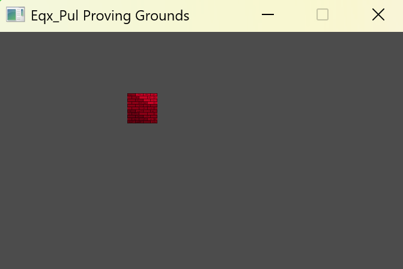
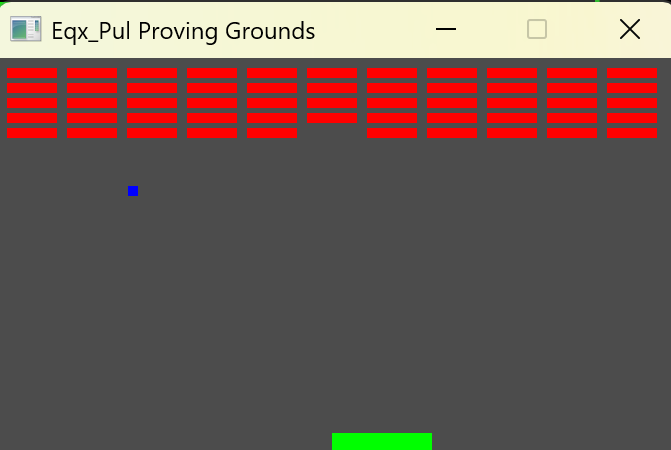
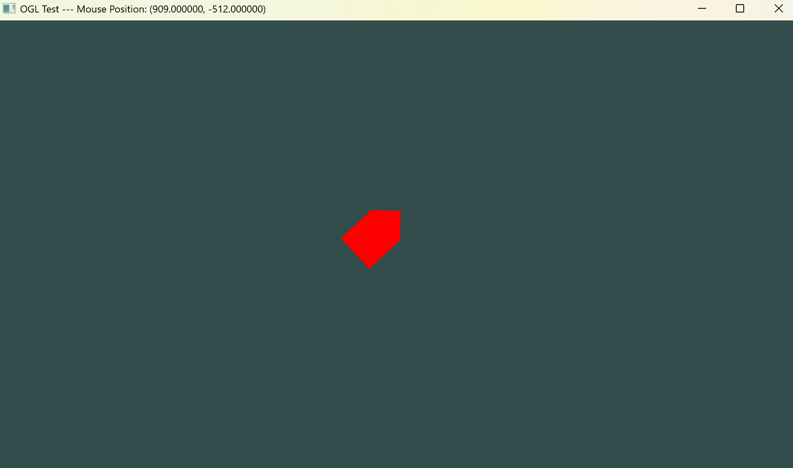

# Pulsar (Alpha)

## Contents

1. [Introduction](#intro)
2. [Adding Pulsar To Your Project](#adding)
3. [Using Pulsar](#using)

## Introduction <a name="intro"></a>

Pulsar is a c++20 framework for video game development, using modern c++ we
strive to provide a safe intuitive environment to build performant games.
Pulsar uses CMake and c++20 modules to ensure a fast and simple build process
and by using windowing and polygon abstractions we make rendering easy.





## Adding Pulsar To Your Project <a name="adding"></a>

To add Pulsar to a project simply download the source code and add the
sub directory with CMake.

```cmake
add_subdirectory(Pul/include/Eqx/Pul/)
```

Here is a full example of a simple CMake config

```cmake
add_subdirectory(path/to/Eqx_Pul/)

add_executable(Main)
target_sources(Main PRIVATE Main.cpp)
target_compile_features(Main PRIVATE cxx_std_20)
set_target_properties(Main PROPERTIES
    CXX_STANDARD_REQUIRED On
    CXX_EXTENSIONS Off
    EXPORT_COMPILE_COMMANDS On)
target_link_libraries(Main PRIVATE Tests Eqx_Lib)
```

## Using Pulsar <a name="using"></a>

Here is a minimum example to get started with

```cpp
import Eqx.Pul;

void run()
{
    auto window = eqx::Window{ 680, 400, "Eqx_Pul Proving Grounds"sv };
    m_Window->makeCurrent();
}

int main()
{
    eqx::Window::init();

    run();

    eqx::Window::term();
}
```
